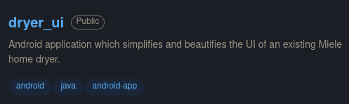
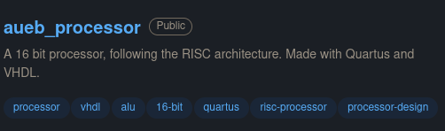
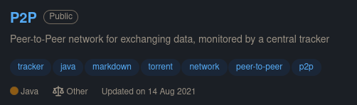
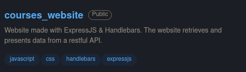

# Hi, I'm Konstantin! 🦉

22 years old CS student from Athens, Greece. 🇬🇷

# Skills

#### Development tools & frameworks

     

#### Programming languages
    

#### Productivity & tools
     

# Notable projects

# Hobbies

* Mountain climbing 🧗⛰️
* Language learning 🇩🇪🇹🇷🇯🇵
* Chess ♕♜
* Gaming 🎮🌃
* History buff 🏺📜
